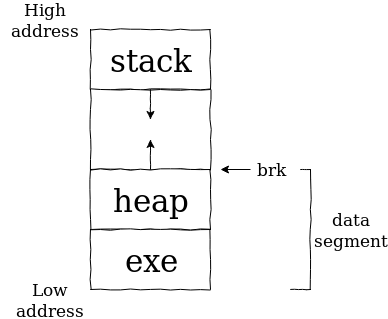
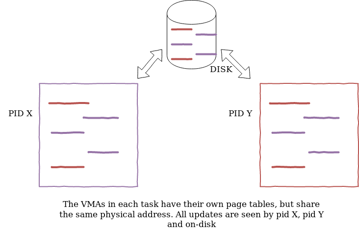
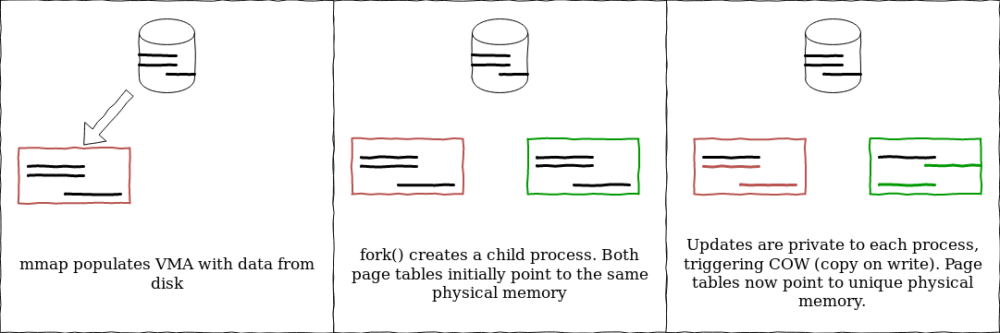

# pg-table_tests


This project consists of a suite of tools to test and verify 5-level page table
behavior on Linux.

As [documented](https://github.com/torvalds/linux/blob/master/Documentation/x86/x86_64/5level-paging.txt) in the Linux kernel
sources, 5-level page tables boosts the virtual address space from 256 TiB
(2<sup>47</sup> bytes) to 128 PiB (2<sup>57</sup> bytes).

Since Linux splits its virtual address space between user and kernel,
applications can expect to see an increase from 128 TiB (2<sup>46</sup> bytes)
to 64 PiB (2<sup>56</sup> bytes).  However, due to backwards compatibility
concerns, this can only be achieved using the `mmap()` call with a specified
hint address above the previous 47-bit limit.

Here is an example `/proc/<pid>/maps` for a process that is utilizing virtual
address above the 47-bit range.  Each of the 1GiB `rw-p` anonymous chunks was
allocated using `mmap()` with a desired hint address:

```
address                            perms offset    dev    inode     pathname
-------------------------------------------------------------------------------------------
00400000-00401000                  r-xp  00000000  fd:00  67184873  /root/mmap
00600000-00601000                  r--p  00000000  fd:00  67184873  /root/mmap
00601000-00602000                  rw-p  00001000  fd:00  67184873  /root/mmap
00768000-00789000                  rw-p  00000000  00:00  0         [heap]
10000000000-10000001000            rw-p  00000000  00:00  0
20000000000-20000001000            rw-p  00000000  00:00  0
40000000000-40000001000            rw-p  00000000  00:00  0
80000000000-80000001000            rw-p  00000000  00:00  0
100000000000-100000001000          rw-p  00000000  00:00  0
200000000000-200000001000          rw-p  00000000  00:00  0
400000000000-400000001000          rw-p  00000000  00:00  0
7f8aa231b000-7f8aa24c7000          r-xp  00000000  fd:00  33555870  /usr/lib64/libc-2.26.so
7f8aa24c7000-7f8aa26c7000          ---p  001ac000  fd:00  33555870  /usr/lib64/libc-2.26.so
7f8aa26c7000-7f8aa26cb000          r--p  001ac000  fd:00  33555870  /usr/lib64/libc-2.26.so
7f8aa26cb000-7f8aa26cd000          rw-p  001b0000  fd:00  33555870  /usr/lib64/libc-2.26.so
7f8aa26cd000-7f8aa26d1000          rw-p  00000000  00:00  0
7f8aa26d1000-7f8aa26f6000          r-xp  00000000  fd:00  33555863  /usr/lib64/ld-2.26.so
7f8aa28eb000-7f8aa28ed000          rw-p  00000000  00:00  0
7f8aa28f5000-7f8aa28f6000          r--p  00024000  fd:00  33555863  /usr/lib64/ld-2.26.so
7f8aa28f6000-7f8aa28f7000          rw-p  00025000  fd:00  33555863  /usr/lib64/ld-2.26.so
7f8aa28f7000-7f8aa28f8000          rw-p  00000000  00:00  0
7fffd27c3000-7fffd27e4000          rw-p  00000000  00:00  0         [stack]
7fffd27fa000-7fffd27fd000          r--p  00000000  00:00  0         [vvar]
7fffd27fd000-7fffd27ff000          r-xp  00000000  00:00  0         [vdso]
800000000000-800000001000          rw-p  00000000  00:00  0
1000000000000-1000000001000        rw-p  00000000  00:00  0
2000000000000-2000000001000        rw-p  00000000  00:00  0
4000000000000-4000000001000        rw-p  00000000  00:00  0
8000000000000-8000000001000        rw-p  00000000  00:00  0
10000000000000-10000000001000      rw-p  00000000  00:00  0
20000000000000-20000000001000      rw-p  00000000  00:00  0
40000000000000-40000000001000      rw-p  00000000  00:00  0
80000000000000-80000000001000      rw-p  00000000  00:00  0
ffffffffff600000-ffffffffff601000  r-xp  00000000  00:00  0         [vsyscall]
```

Notice that the stack is still located towards the end of 4-level page table
virtual address space limit.  This memory layout suggests that `mmap()` may be
the only way for user programs to directly use the additional address space
provided by 5-level page tables.  Functions like `malloc()`, `sbrk()/brk()` and
`alloca()` that manipulate the stack/heap should be constrained to the previous
47-bit addressing limit.

## Configuration

The `run-tests` script will determine if 5-level page tables are fully supported
(see requirements in following sub-sections).  If any of the prerequisites are
not detected, `run-tests` will fall back to executing its tests with 4-level
page tables in mind.

### Processor

5-level page tables must have processor support.  This project is exercising the
x86_64 variant of Linux, therefore we are require the Intel 'la57' cpu flag:

```
% grep la57 /proc/cpuinfo | head -n1
flags           : ... snip ... la57
```

This feature may be emulated by QEMU's qemu64 cpu with the following option:
```
qemu-system-x86_64 ... -cpu qemu64,+la57
```
Note: this option is not compatible with `-enable-kvm`.

### Linux config

The Linux kernel must have 5-level page table support enabled:

```
grep CONFIG_X86_5LEVEL /boot/config-$(uname -r)
CONFIG_X86_5LEVEL=y
```

## Building

Test programs can be built using the project's Makefile:

```
% make
cc     heap.c   -o heap
cc     mmap+memset+fork.c   -o mmap+memset+fork
```

`$CC` and `$CFLAGS` build options may be overridden on the command line:

```
% CC=clang CFLAGS='-ggdb -Wall' make
clang -ggdb -Wall    heap.c   -o heap
clang -ggdb -Wall    mmap+memset+fork.c   -o mmap+memset+fork
```

Binaries and temporary files can be cleaned up using the `make clean` target.

For developers, shell scripts can be run through
[ShellCheck](https://github.com/koalaman/shellcheck) and C sources
through the [cppcheck](http://cppcheck.sourceforge.net/) linters using the
`make check` target.  See each program's respective webpage for installation
instructions.

## Running

Tests may be run individually (use `--help` for usage), or collectively via the
`run-tests` script.


## Tests

### heap

In x86 architecture, the stack grows up and towards the heap (which by
convention grows in the opposite direction to the stack).



By the sample `/proc/<pid>/maps` listing provided at the top, the stack is
currently set at address range, 7fffd27c3000-7fffd27e400. Thus it only takes 47
bits (log 7fffd27e4000 / log 2) to address this space. As the heap can't grow
past the stack, this means that like the stack, only 47 bits are needed to
address the heap even while using the 5-level page tables.

This program tests to check if heap allocations can surpass 4-level page table
tests.

#### Usage

```
Usage: ./heap
-m, --malloc		uses malloc to allocate memory
-s, --sbrk		uses sbrk to allocate memory
-h, --help              prints out help message

```
#### malloc

The malloc test allocates as much memory as it can, 1 GiB at a time, pushing the
heap up to higher and higher address ranges. (This memory is left
uninitialized.) Once the `malloc()` call fails, the test then returns the number
of gigabytes allocated.

Expected return values:
```
4-level page tables: ~130000 GiB
5-level page tables: ~130000 GiB
```
as it only takes 47bits to address ~130000 GiB

#### sbrk

The sbrk test grows the heap by changing the location of the program break,
which defines the end of a process's data segment. Like the malloc test, this
effectively allocates more virtual memory space to the calling process.

Expected return values:
```
4-level page tables: ~130000 GiB
5-level page tables: ~130000 GiB
```

### mmap+memset+fork

On x86 architecture, 5-level paging enables 56-bit userspace virtual address
space. However, not all user space is ready to handle such wide addresses. To
mitigate this, the kernel will not allocate virtual space above 47-bit by
default. But userspace can ask for allocation from full address space by
specifying hint address (with or without `MAP_FIXED`) above 47-bits.

This program verifies that `mmap()` is possible beyond the 4-level
page table range when supported and specifically requested.  The test
program also verifies COW (copy on write) behaviour functions correctly
while forking and sharing mappings.

Due to the indeterminate execution order (no pattern to the printing out of the
PIDs post forking), the verification loop at the end of the program occasionally
reports read != write. This only shows in the `MAP_SHARED` cases as
`MAP_PRIVATE` keeps all the processes private from each other. Managing process
execution order is an area for improvement.

#### Usage

```
Usage: ./mmap+memset+fork [OPTION]

-d, --debug		prints out the PID and address touched by memset
-k, --keystroke		same as debug, but requires a char to be entered to show each line
-h, --help              prints out help message
-f, --fork_child        causes program to fork a child process
-b, --begin             mmaps and memsets from 2^(arg)
-e, --end               mmaps and memsets till 2^(arg)
-m, --mmap_order        mmaps given 2^(arg) size
-n, --set_order         memsets given 2^(arg) size
-u, --map_populate      sets MAP_POPULATE flag in mmap
-a, --map_anonymous     sets MAP_ANONYMOUS flag in mmap
-s, --map_shared        sets MAP_SHARED flag in mmap
-p, --map_private       sets MAP_PRIVATE flag in mmap
```


#### MAP_FIXED

In order to successfully allocate large virtual address space as described by
the Linux
[documentation](https://github.com/torvalds/linux/blob/master/Documentation/x86/x86_64/5level-paging.txt),
the mmap+memset+fork will always call `mmap()` with the `MAP_FIXED` flag set.

To illustrate, we can invoke mmap+memset+fork to create a series of mmap
requests, starting with a fixed address at 0x100000000000 (2^44 bytes) and
ending at 0x1000000000000 (2^56 bytes):

4-level page tables results:
```
./mmap+memset+fork --begin 44 --end 56 --map_private
i=44,addr=0x100000000000,ptr=0x100000000000
i=45,addr=0x200000000000,ptr=0x200000000000
i=46,addr=0x400000000000,ptr=0x400000000000
i=47,addr=0x800000000000,ptr=0xffffffffffffffff
mmap: Cannot allocate memory
```

5-level page tables results:
```
./mmap+memset+fork --begin 44 --end 56 --map_private
i=44,addr=0x100000000000,ptr=0x100000000000
i=45,addr=0x200000000000,ptr=0x200000000000
i=46,addr=0x400000000000,ptr=0x400000000000
i=47,addr=0x800000000000,ptr=0x800000000000
i=48,addr=0x1000000000000,ptr=0x1000000000000
i=49,addr=0x2000000000000,ptr=0x2000000000000
i=50,addr=0x4000000000000,ptr=0x4000000000000
i=51,addr=0x8000000000000,ptr=0x8000000000000
i=52,addr=0x10000000000000,ptr=0x10000000000000
i=53,addr=0x20000000000000,ptr=0x20000000000000
i=54,addr=0x40000000000000,ptr=0x40000000000000
i=55,addr=0x80000000000000,ptr=0x80000000000000
i=56,addr=0x100000000000000,ptr=0xffffffffffffffff
mmap: Cannot allocate memory
```

The results for the 5-level page table test confirms that using
`MAP_FIXED` and a very large hint address, we can utilize the extra
virtual address space unavailable to the 4-level page table test.


#### MAP_SHARED



4-level page tables
```
./mmap+memset+fork --begin 44 --end 55 --map_shared
i=44,addr=0x100000000000,ptr=0x100000000000
i=45,addr=0x200000000000,ptr=0x200000000000
i=46,addr=0x400000000000,ptr=0x400000000000
i=47,addr=0x800000000000,ptr=0xffffffffffffffff
mmap: Cannot allocate memory
```

5 level page table

```
./mmap+memset+fork --begin 44 --end 55 --map_shared
i=44,addr=0x100000000000,ptr=0x100000000000
i=45,addr=0x200000000000,ptr=0x200000000000
i=46,addr=0x400000000000,ptr=0x400000000000
i=47,addr=0x800000000000,ptr=0x800000000000
i=48,addr=0x1000000000000,ptr=0x1000000000000
i=49,addr=0x2000000000000,ptr=0x2000000000000
i=50,addr=0x4000000000000,ptr=0x4000000000000
i=51,addr=0x8000000000000,ptr=0x8000000000000
i=52,addr=0x10000000000000,ptr=0x10000000000000
i=53,addr=0x20000000000000,ptr=0x20000000000000
i=54,addr=0x40000000000000,ptr=0x40000000000000
i=55,addr=0x80000000000000,ptr=0x80000000000000
PID = 9975
PID = 9976
```

#### MAP_PRIVATE



4-level page tables
```
./mmap+memset+fork --begin 44 --end 55 --map_private
i=44,addr=0x100000000000,ptr=0x100000000000
i=45,addr=0x200000000000,ptr=0x200000000000
i=46,addr=0x400000000000,ptr=0x400000000000
i=47,addr=0x800000000000,ptr=0xffffffffffffffff
mmap: Cannot allocate memory
```
5-level page table
```
./mmap+memset+fork --begin 44 --end 55 --map_private
i=44,addr=0x100000000000,ptr=0x100000000000
i=45,addr=0x200000000000,ptr=0x200000000000
i=46,addr=0x400000000000,ptr=0x400000000000
i=47,addr=0x800000000000,ptr=0x800000000000
i=48,addr=0x1000000000000,ptr=0x1000000000000
i=49,addr=0x2000000000000,ptr=0x2000000000000
i=50,addr=0x4000000000000,ptr=0x4000000000000
i=51,addr=0x8000000000000,ptr=0x8000000000000
i=52,addr=0x10000000000000,ptr=0x10000000000000
i=53,addr=0x20000000000000,ptr=0x20000000000000
i=54,addr=0x40000000000000,ptr=0x40000000000000
i=55,addr=0x80000000000000,ptr=0x80000000000000
PID = 9987
PID = 9988

```
#### MAP_ANONYMOUS | MAP_SHARED

Similar to `MAP_SHARED` example above, after the `fork()` both processes have 
their own page tables but the same physical memory. The MAP_ANONYMOUS flag 
indicates that the mapping is not backed by any file; it's contents are 
initialized to zero.

4-level page tables
```
./mmap+memset+fork --begin 44 --end 55 --map_shared --map_anonymous
i=44,addr=0x100000000000,ptr=0x100000000000
i=45,addr=0x200000000000,ptr=0x200000000000
i=46,addr=0x400000000000,ptr=0x400000000000
i=47,addr=0x800000000000,ptr=0xffffffffffffffff
mmap: Cannot allocate memory
```
5 level page table
```
./mmap+memset+fork --begin 44 --end 55 --map_shared --map_anonymous
i=44,addr=0x100000000000,ptr=0x100000000000
i=45,addr=0x200000000000,ptr=0x200000000000
i=46,addr=0x400000000000,ptr=0x400000000000
i=47,addr=0x800000000000,ptr=0x800000000000
i=48,addr=0x1000000000000,ptr=0x1000000000000
i=49,addr=0x2000000000000,ptr=0x2000000000000
i=50,addr=0x4000000000000,ptr=0x4000000000000
i=51,addr=0x8000000000000,ptr=0x8000000000000
i=52,addr=0x10000000000000,ptr=0x10000000000000
i=53,addr=0x20000000000000,ptr=0x20000000000000
i=54,addr=0x40000000000000,ptr=0x40000000000000
i=55,addr=0x80000000000000,ptr=0x80000000000000
PID = 9983
PID = 9984
PID = 9984, 0x800000000 read(0xff) != write_pattern(0x00)
PID = 9983, 0x40000000 read(0x00) != write_pattern(0xff)
PID = 9983, 0x80000000 read(0x00) != write_pattern(0xff)
PID = 9983, 0x100000000 read(0x00) != write_pattern(0xff)
PID = 9983, 0x200000000 read(0x00) != write_pattern(0xff)
PID = 9983, 0x400000000 read(0x00) != write_pattern(0xff)
PID = 9983, 0x1000000000 read(0x00) != write_pattern(0xff)

```


#### MAP_ANONYMOUS | MAP_PRIVATE

Similar to the MAP_PRIVATE example shown above, updates are private to each
process and post update page tables point to unique physical memory. The 
MAP_ANONYMOUS flag indicates that the mapping is not backed by any file; 
it's contents are initialized to zero.

4-level page tables
```
./mmap+memset+fork --begin 44 --end 55 --map_private --map_anonymous
i=44,addr=0x100000000000,ptr=0x100000000000
i=45,addr=0x200000000000,ptr=0x200000000000
i=46,addr=0x400000000000,ptr=0x400000000000
i=47,addr=0x800000000000,ptr=0xffffffffffffffff
mmap: Cannot allocate memory
```
5 level page tables
```
./mmap+memset+fork --begin 44 --end 55 --map_private --map_anonymous
i=44,addr=0x100000000000,ptr=0x100000000000
i=45,addr=0x200000000000,ptr=0x200000000000
i=46,addr=0x400000000000,ptr=0x400000000000
i=47,addr=0x800000000000,ptr=0x800000000000
i=48,addr=0x1000000000000,ptr=0x1000000000000
i=49,addr=0x2000000000000,ptr=0x2000000000000
i=50,addr=0x4000000000000,ptr=0x4000000000000
i=51,addr=0x8000000000000,ptr=0x8000000000000
i=52,addr=0x10000000000000,ptr=0x10000000000000
i=53,addr=0x20000000000000,ptr=0x20000000000000
i=54,addr=0x40000000000000,ptr=0x40000000000000
i=55,addr=0x80000000000000,ptr=0x80000000000000
PID = 9985
PID = 9986
```
